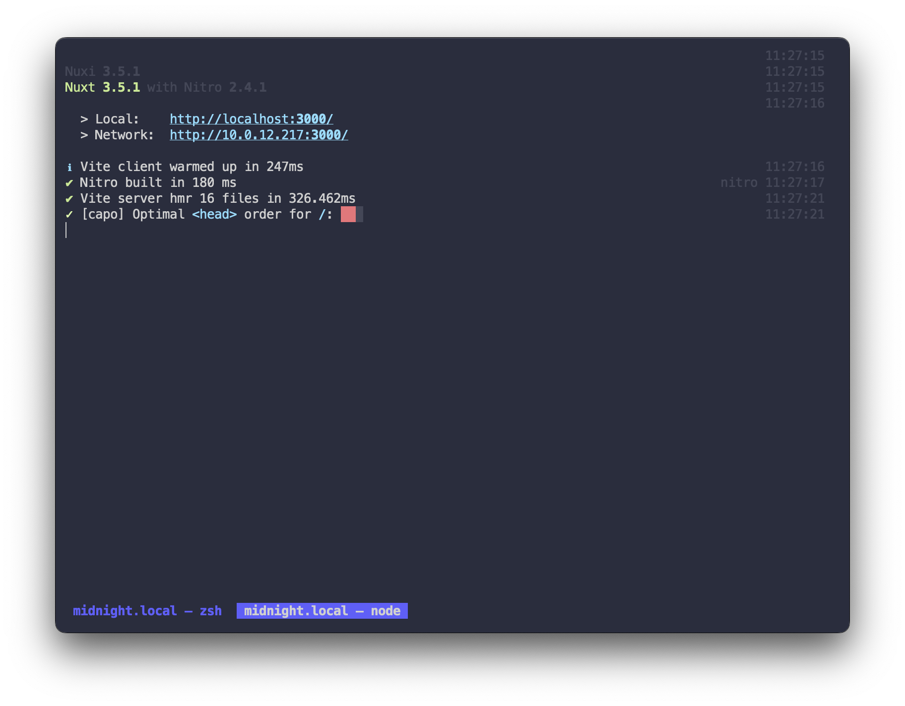
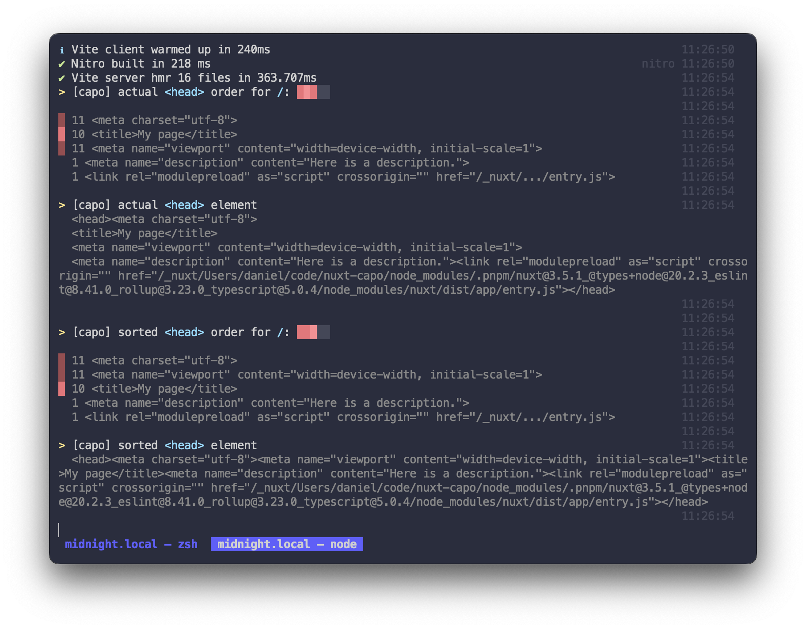

# capo.js for Nuxt

[![npm version][npm-version-src]][npm-version-href]
[![npm downloads][npm-downloads-src]][npm-downloads-href]
[![Github Actions][github-actions-src]][github-actions-href]
[![Codecov][codecov-src]][codecov-href]

> `capo.js` implementation for [Nuxt 3](https://nuxt.com)

- [✨ &nbsp;Changelog](https://github.com/danielroe/nuxt-capo/blob/main/CHANGELOG.md)
- [▶️ &nbsp;Online playground](https://stackblitz.com/github/danielroe/nuxt-capo/tree/main/playground)

## What is Capo.js
[Capo.js](https://github.com/rviscomi/capo.js) is a small snippet that identifies ways to boost the (perceived) performance of your page, by changing the order of elements in the page's `<head>` section.

## Features

- ✨ validates your `<head>` in dev mode and when prerendering pages
- 🔎 visualises optimal head configuration

## Installation

Install and add `nuxt-capo` to your `nuxt.config`.

```bash
npx nuxi@latest module add capo
```

```js
export default defineNuxtConfig({
  modules: ['nuxt-capo'],
})
```

## Usage

That's it! You should now see debugging info and suggestions when server rendering your routes

| | |
| - | - |
| |  |

## Credits

Thanks to [**@rviscomi**](https://github.com/rviscomi) for making [capo.js](https://github.com/rviscomi/capo.js)!

## 💻 Development

- Clone this repository
- Enable [Corepack](https://github.com/nodejs/corepack) using `corepack enable`
- Install dependencies using `pnpm install`
- Stub module with `pnpm dev:prepare`
- Run `pnpm dev` to start [playground](./playground) in development mode

## License

Made with ❤️

Published under the [MIT License](./LICENCE).

<!-- Badges -->

[npm-version-src]: https://img.shields.io/npm/v/nuxt-capo?style=flat-square
[npm-version-href]: https://npmjs.com/package/nuxt-capo
[npm-downloads-src]: https://img.shields.io/npm/dm/nuxt-capo?style=flat-square
[npm-downloads-href]: https://npm.chart.dev/nuxt-capo
[github-actions-src]: https://img.shields.io/github/actions/workflow/status/danielroe/nuxt-capo/ci.yml?branch=main
[github-actions-href]: https://github.com/danielroe/nuxt-capo/actions?query=workflow%3Aci
[codecov-src]: https://img.shields.io/codecov/c/gh/danielroe/nuxt-capo/main?style=flat-square
[codecov-href]: https://codecov.io/gh/danielroe/nuxt-capo
